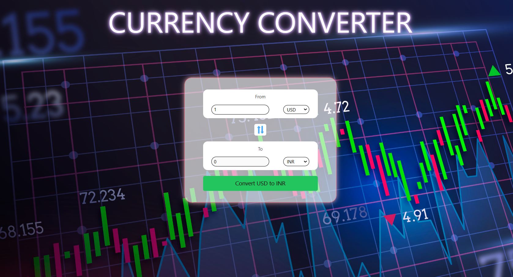

<!-- This template provides a minimal setup to get React working in Vite with HMR and some ESLint rules.

Currently, two official plugins are available:

- [@vitejs/plugin-react](https://github.com/vitejs/vite-plugin-react/blob/main/packages/plugin-react/README.md) uses [Babel](https://babeljs.io/) for Fast Refresh
- [@vitejs/plugin-react-swc](https://github.com/vitejs/vite-plugin-react-swc) uses [SWC](https://swc.rs/) for Fast Refresh -->

# Currency Converter 
## Mini-Project of React
It is a web application that allows users to convert amounts from one currency to another. It fetches real-time exchange rates from an API and updates the results dynamically.

>## Features:
>1. User Input: Users can enter the amount they want to convert.
>
>2. Dropdown Menus: Users can select the source and target currencies from dropdowns.
>3. Real-Time Rates: The app fetches the latest exchange rates using an API.
>4. Responsive UI: Designed to work seamlessly across devices.

> ## Technologies Used:
>1. React + Vite : For building the UI and managing state.
>
>2. Fetched API : To call the exchange rate API.
>
> - API USED : <https://api.currencyapi.com/v3/historical?apikey=cur_live_4HbiQPkQB8F6ruuuqt3r2FN6m9LqPbnykx51LVk9&base_currency={from-Currency}&date={date}>
>
>
>3. Tailwind CSS : For styling the application.
>
>4. useId hook for mapping the label and input
>
>5. Animated Icons : lordicons for animated JSON format icons

## UI : 
